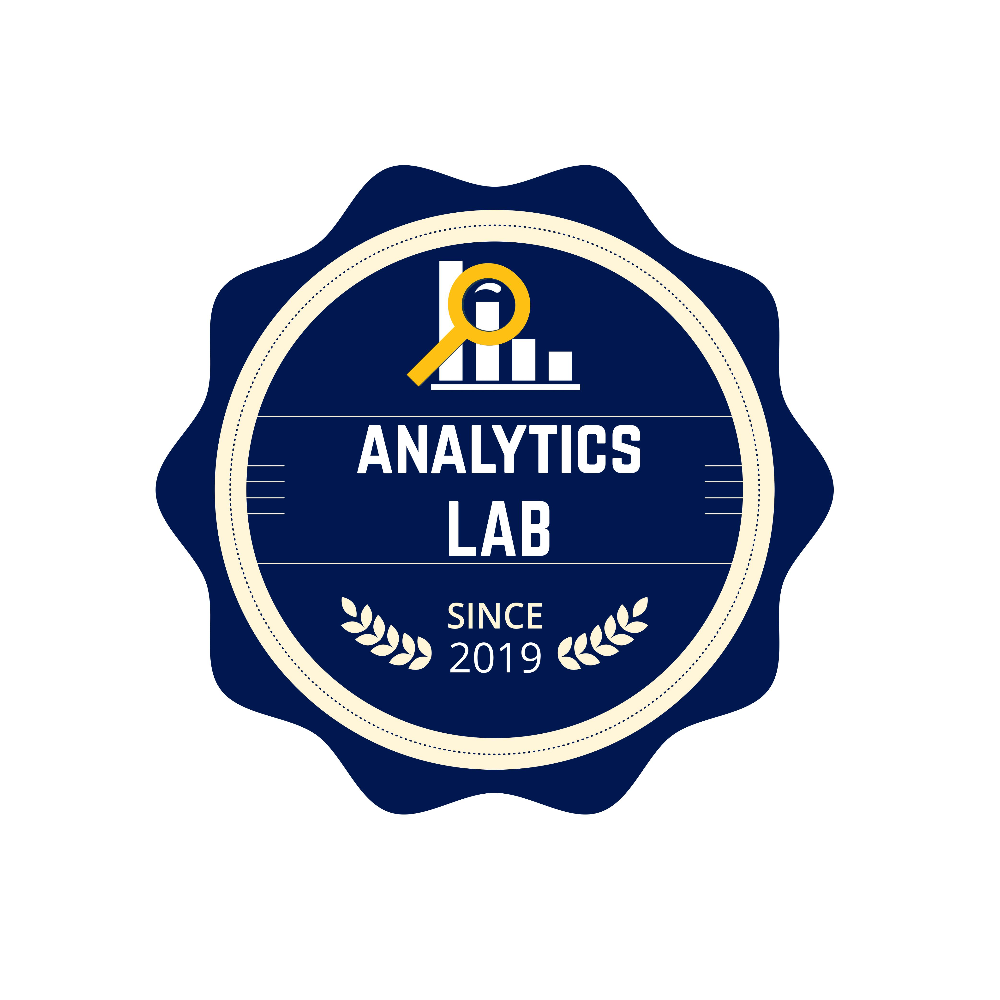

# **Acerca de Nosotras** {#acerca}

>Somos un grupo enfocado en incentivar la programacion y analisis de datos mediante la herramienta
>de R.
 >
>Ubicado en la ciudad de Barranquilla, fue originado en la Universidad del Norte por estudiantes
>pertenecientes al  grupo Analytics en  el cual sus actividades principales son Data Science.

# **Mision**
>Promover el uso de R entre la mujeres.
>
>
>
>
>
>.

# **Vision**
>Incrementar la cantidad de mujeres que poseen conocimiento de R .

# **Objetivo**
>Ser una comunidad que incentiva, apoya y acompaña a las mujeres 
que saben o desean aprender a usar R.

250;">

250;" >

